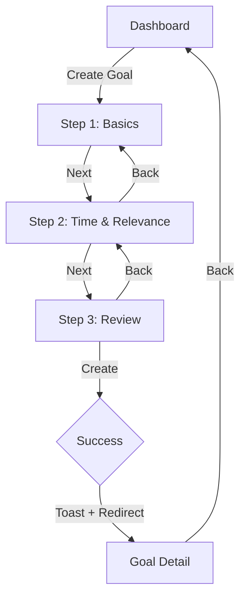
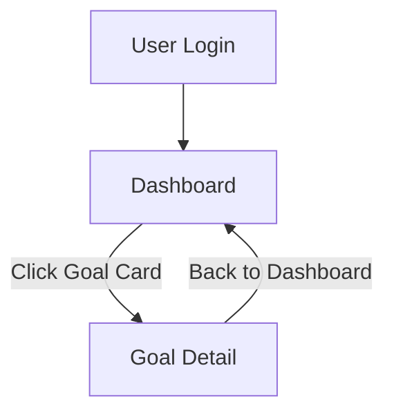
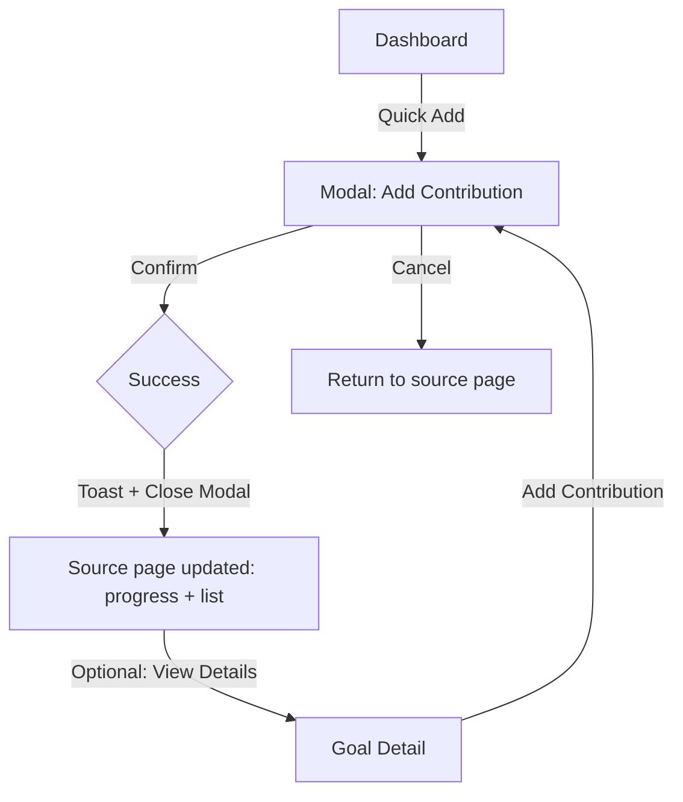

# User-Scenario-01 — Create a SMART Goal

_Last updated: **2025-08-22** • **Owner:** Yanqiu Li • **Status:** Ready for prototyping_

---

## 1. Overview
Create a new financial goal via a **3-step wizard**. On success, the user lands on **Goal Detail** and sees initial progress.

*User value*: Clear target + deadline, instant feasibility hint, and a visible starting point to drive action.

**Related**
- **Epic:** 01 SMART Goals Framework  
- **User Stories:** `US_01` (Define specific goal), `US_05` (Time-bound deadline)

## 2. Scope

| In Scope (MVP / prototype) | Out of Scope |
| --- | --- |
| • 3 steps: **Basics → Time & Relevance → Review** • Simple feasibility hint via static formula • Success toast + redirect to Goal Detail • Dashboard shows the newly created goal card | • Sharing / collaborators • Advanced scoring • Bank connections • AI copy • Reports & reminders |

## 3. Assumptions & Preconditions
- User is authenticated.  
- No backend integration required for the prototype; values may be mocked.  
- Currency is `AU$` and accepts two decimals.

## 4. Entry Points
- Dashboard primary CTA: Create Goal 
- Empty-state CTA on Dashboard (if no goals yet)

## 5. Flowchart

## 6. Screens & Components

### Step&nbsp;1 — Basics
- **Fields**
  - `Goal Title`* (text, placeholder: *“Buy a car”*)
  - `Category` (select — Savings / Debt / Education / Other)
  - `Target Amount`* (number)
  - `Initial Amount` (number, default 0)
- **Actions**  
  `Next` (disabled until required fields valid) · `Cancel` (returns to Dashboard)

### Step&nbsp;2 — Time & Relevance
- **Fields**
  - `Deadline`* (date picker, must be future)
  - `Motivation / Why` (textarea, optional)
  - `Estimated Monthly Contribution` (number, optional)
- **System hints**
  - `Suggested Monthly = (Target − Initial) / RemainingMonths`
  - Feasibility badge: **Feasible** if `Estimated ≥ Suggested`, else **At Risk**
- **Actions**  
  `Back`, `Next` (enabled when Deadline is valid)

### Step&nbsp;3 — Review
- **Summary card** — Title · Category · Target/Initial · Deadline · Suggested Monthly · Feasible/At Risk  
- **Actions**  
  `Back`, `Create` (enabled when all validations pass)

### Goal Detail (landing after Create)
- **Header** — Title · Deadline · Current vs Target
- **Progress ring** — `Current/Target %`
- **Actions**  
  `Add Contribution`, `Automation`, `Back to Dashboard`

---

## 7. Field Spec & Rules

| Field                | Type    | Required | Default / Placeholder | Rules                          |
|----------------------|---------|:--------:|-----------------------|--------------------------------|
| Goal Title           | text    | ✓        | “Buy a car”           | 1 – 60 chars                   |
| Category             | select  |          | Savings / Debt / …    | —                              |
| Target Amount        | number  | ✓        | —                     | > 0, max 2 decimals            |
| Initial Amount       | number  |          | 0                     | ≥ 0 and ≤ Target               |
| Deadline             | date    | ✓        | —                     | Must be > today                |
| Motivation           | textarea|          | —                     | ≤ 200 chars                    |
| Estimated Monthly    | number  |          | —                     | ≥ 0                            |

## 8. Validation & Errors

- Missing required field → `This field is required`
- Target < Initial → `Initial cannot exceed Target`
- Deadline ≤ today → `Pick a future date`
- RemainingMonths = 0 → `Choose a later deadline`
- Invalid amount format → `Enter a valid amount`

---

# User-Scenario-02 — View Measurable Progress on Dashboard (Progress Overview & Goal Detail)

_Last updated: 2025-08-24 • Owner: Siyang Wang • Status: Ready for prototyping_

## 1. Overview
Upon login, the user lands on the Dashboard to get an overview of all ongoing financial goals and their core progress. By clicking any goal card, the user can drill down to the Goal Detail page to view detailed data, progress visualizations, and recent contribution history for that goal.

**User value**: Provides a clear, at-a-glance overview for users to quickly grasp the health of all their goals, and to understand specific progress through a detailed view, helping them stay motivated and in control.

**Related**
- **Epic:** 01 SMART Goals Framework
- **User Stories:** **US_02** (Measurable progress tracking)

## 2. Scope

### In Scope (MVP for prototype)
- Dashboard displays all goals as cards 
- Goal cards show key info: title, progress bar, current/target amounts 
- Clicking a card navigates to the Goal Detail page 
- Goal Detail page shows a progress ring, detailed amounts, and contribution history 
- Simple empty state (when no goals exist)

### Out of Scope
- Sorting, filtering, or searching for goals 
- Advanced charts and comparative analysis 
- Milestone achievement alerts and celebration animations 
- Editing or deleting goals directly from this view

## 3. Assumptions & Preconditions
User is authenticated.

At least one financial goal exists (to display the non-empty state).

Prototype uses mocked data; all calculations are done on the client.

Currency is AU$ and accepts two decimals.

## 4. Entry Points
After logging in, the user lands on the Dashboard by default.

Navigating back to the Dashboard from other pages (e.g., Goal Detail).

## 5. Flowchart

## 6. Screens & Components

**Dashboard**

- Overview

  - Page title (e.g., “My Goals”)

  - Goal List/Grid: Contains a series of Goal Card components.

- **Component: Goal Card**

  - Goal Title

  - Progress Bar - Visual representation of (Current Amount / Target Amount) %

  - Current Amount vs Target Amount (e.g., $1,500 / $10,000)

  - Deadline

  - Quick Add button (links to User-Scenario-03)

**Goal Detail**

- Header

  - Goal Title

  - Deadline

- Progress Section

  - Progress Ring - Visual representation of Current/Target %

  - Current Amount of Target Amount

  - Amount Remaining

- Contributions Section

  - Title: Recent Contributions

  - List: Displays contribution records in descending order by date (Date, Amount, Source, Note)

- Actions

  - Add Contribution button (links to User-Scenario-03)

  - Back to Dashboard link/button

**Edge Cases & States**

- No goals exist (empty state)
- Goal is completed (Current Amount = Target Amount)
- Goal is overdue (Deadline < today)

---

# User-Scenario-03 — Quick Manual Contribution

_Last updated: **2025-08-22** • **Owner:** Yanqiu Li • **Status:** Ready for prototyping_

---

## 1. Overview
Add a manual contribution to a goal via a lightweight modal. On success, the current amount, progress, and recent contributions are updated instantly on the source page (Dashboard or Goal Detail).

**User value**: Fast, low-friction way to record savings and see immediate progress.

**Related**
- **Epic**: 02 Advanced Allocation System  
- **User Stories**: **US_06** Manual Input Allocations

## 2. Scope

### In Scope (MVP for prototype)
- Entry from **Dashboard – Quick Add** and **Goal Detail – Add Contribution**
- Modal with basic fields and client-side validation
- Success toast + UI updates (current amount, progress bar/ring, recent list)
- **Over Target** label if the new current amount exceeds target

### Out of Scope
- Bulk import, undo/rollback, attachments, budgeting advice, cross-goal split, bank integrations

## 3. Assumptions & Preconditions
- User is authenticated.
- At least one goal exists.
- Prototype uses mocked data; calculations are done in the client.
- Currency is in `AU$` with two decimals.

## 4. Entry Points
- **Dashboard** → goal card → `Quick Add`
- **Goal Detail** → header actions → `Add Contribution`

## 5. Flowchart

## 6. Screens & Components

### Source pages
- **Dashboard (with goals)**
  - Goal card shows: Title, Current/Target, progress bar, `Quick Add` button
- **Goal Detail**
  - Header shows: Title, Current/Target, progress ring, `Add Contribution` button
  - Section: `Recent Contributions` (list of date/amount/source/note)

### Modal — Add Contribution
- **Fields**
  - `Amount`* (number)
  - `Date` (date, default today)
  - `Source` (select: Salary / Bonus / Other)
  - `Note` (textarea, optional, ≤ 100 chars)
- **Actions**
  - `Confirm` (disabled until valid)
  - `Cancel` (closes without saving)

### Post-update UI
- Current amount increases; progress bar/ring updates
- New row appears at top of `Recent Contributions`
- If Current > Target, show **Over Target** label near progress or the new row

## 7. Field Spec & Rules

| Field   | Type   | Required | Default/Placeholder | Rules                  |
|--------|--------|:--------:|---------------------|------------------------|
| Amount | number | ✓        | —                   | > 0, max 2 decimals   |
| Date   | date   |          | today               | any valid date        |
| Source | select |          | Other               | Salary / Bonus / Other|
| Note   | text   |          | —                   | ≤ 100 chars           |

**Calculations**
- `Current_new = Current_old + Amount`
- `Progress% = (Current_new / Target) * 100`
- If `Current_new > Target` → show **Over Target**

## 8. Validation & Errors
- Amount missing or ≤ 0 → `Enter a positive amount`
- Invalid amount format → `Enter a valid amount`
- Generic failure (demo only) → toast `Something went wrong. Try again.`